## System Architecture Blueprint

### App Summary

**End Goal:** Donner aux artisans et TPE du bâtiment en France un poste de pilotage pour devis, facturation, dossier client et agenda, avec abonnement équitable (pas de commission cachée sur les chantiers).

**Template Foundation:** **adk-agent-saas** : Next.js (App Router), Supabase (Auth, PostgreSQL, stockage objet), Drizzle ORM, Stripe (abonnement, webhooks), assistant **ADK** en Python déployé séparément du front.

**Required Extensions:** Écrans et logique métier **ReglePro** (tableau de bord, clients, devis, factures, agenda) via **Server Actions** et schéma Postgres étendu ; **stockage objet** pour pièces jointes et PDF ; trajectoire future pour **assistant métier** (réutilisation ou remplacement du graphe d’agents « analyse concurrentielle » hérité).

---

## System Architecture

### Template Foundation

**Chosen template:** adk-agent-saas

**Built-in capabilities:**

- **Auth et session** : Supabase Auth, middleware Next.js, profil `/profile`
- **Données applicatives** : PostgreSQL via Drizzle, tables `users`, `session_names`, `user_usage_events`
- **Monétisation** : Stripe Customer, webhooks, portail client, tiers free / paid côté app
- **Assistant IA** : service Python ADK (`apps/competitor-analysis-agent`), session ADK, persistance des titres de session côté web, flux type **SSE** entre le navigateur et l’agent
- **Usage** : événements horodatés pour plafonds messages / sessions (chat)

### Architecture Diagram

```mermaid
flowchart TB
    subgraph UIL["User Interface Layer"]
        P1["Pages publiques et légal / /privacy /terms"]
        P2["Flux auth /auth"]
        P3["App protégée ReglePro dashboard clients devis factures agenda profil"]
        P4["Assistant héritage /chat /history"]
    end

    subgraph ALTF["Application Layer - Template Foundation"]
        MW["Middleware auth et routes protégées"]
        SA0["Server Actions existantes profil billing usage"]
        APIW["Route API webhooks Stripe"]
        APIADK["Routes ou handlers reliant le chat au service ADK"]
    end

    subgraph ALE["Application Layer - Extensions ReglePro"]
        SAM["Server Actions métier devis factures clients agenda"]
        VAL["Validation et règles métier côté serveur"]
    end

    subgraph ADK["ADK Agent Server - héritage analyse concurrentielle"]
        subgraph ROOT["Root Agent"]
            RA["competitor_analysis_agent LlmAgent"]
        end
        subgraph TOOLS["Outils et sous-pipeline"]
            PG["plan_generator_agent LlmAgent"]
            RP["research_pipeline SequentialAgent"]
            SR["section_researcher LlmAgent"]
            RC["report_composer LlmAgent"]
            LOOP["iterative_refinement_loop LoopAgent"]
        end
        subgraph ADKINF["ADK Infrastructure"]
            SES["Sessions ADK état et callbacks"]
            VTX["Vertex AI Gemini via ADK"]
        end
    end

    subgraph DLT["Data Layer - Template Foundation"]
        TUsers["Table users"]
        TSess["Table session_names"]
        TUse["Table user_usage_events"]
    end

    subgraph DLE["Data Layer - Extensions"]
        M1["Futur schéma clients quotes invoices agenda_events"]
    end

    subgraph STG["Storage Layer"]
        SBLOB["Supabase Storage buckets PDF PJ photos"]
    end

    subgraph EXT["External Services"]
        STR["Stripe API et webhooks"]
        SUPA["Supabase Auth et Postgres"]
        GSRCH["Google Search intégré ADK si activé"]
    end

    P1 --> MW
    P2 --> MW
    P3 --> MW
    P4 --> MW
    P3 --> SAM
    P3 --> SA0
    P4 --> APIADK
    SA0 --> APIW
    SAM --> VAL
    VAL --> M1
    SA0 --> TUsers
    SAM --> M1
    APIW --> STR
    MW --> SUPA
    SAM --> SUPA
    SA0 --> SUPA
    APIADK -.->|HTTP SSE session| RA
    RA --> PG
    RA --> RP
    RP --> SR
    RP --> RC
    RP --> LOOP
    RA --> SES
    PG --> SES
    RP --> VTX
    APIADK --> TSess
    APIADK --> TUse
    SAM --> SBLOB
    RA -.-> GSRCH

    classDef userInterface fill:#1E88E5,stroke:#1565C0,stroke-width:2px,color:#fff
    classDef frontend fill:#42A5F5,stroke:#1976D2,stroke-width:2px,color:#fff
    classDef backend fill:#66BB6A,stroke:#388E3C,stroke-width:2px,color:#fff
    classDef database fill:#4CAF50,stroke:#2E7D32,stroke-width:2px,color:#fff
    classDef aiServices fill:#AB47BC,stroke:#7B1FA2,stroke-width:2px,color:#fff
    classDef adkAgent fill:#9C27B0,stroke:#6A1B9A,stroke-width:3px,color:#fff
    classDef external fill:#FF7043,stroke:#D84315,stroke-width:2px,color:#fff
    classDef payment fill:#FFA726,stroke:#F57C00,stroke-width:2px,color:#fff
    classDef storage fill:#26A69A,stroke:#00695C,stroke-width:2px,color:#fff

    class P1,P2,P3,P4 userInterface
    class MW,SA0,APIW,APIADK,SAM,VAL frontend
    class RA,PG,RP,SR,RC,LOOP,SES,VTX adkAgent
    class TUsers,TSess,TUse,M1 database
    class SBLOB storage
    class STR payment
    class SUPA,GSRCH external
```

### Extension Strategy

**Why these extensions:** Le blueprint produit et le schéma stratégique imposent des **entités métier** persistantes que le template chat ne modélise pas. Les **Server Actions** restent le mode privilégié pour mutations et lecture serveur sans exposer une API JSON métier généraliste, aligné avec `app_pages_and_functionality.md`.

**Integration points:** Les extensions **lisent et écrivent le même Postgres** que le template via Drizzle, avec **RLS Supabase** par `user_id` sur les nouvelles tables. Stripe et l’**usage chat** restent inchangés tant que le parcours assistant est conservé.

**Avoided complexity (MVP):** Pas de file d’attente dédiée type Redis, pas de microservices métier séparés, pas de GraphQL public, pas de temps réel WebSocket pour l’agenda tant que le rechargement ou le polling léger suffit. Pas de second cluster base avant besoin multi-région avéré.

### System Flow Explanation

**Template foundation flow:** L’utilisateur s’authentifie via Supabase, le middleware protège `(protected)`, le profil et Stripe utilisent `users` et les webhooks. Le chat crée des sessions ADK, enregistre les titres dans `session_names`, et les quotas via `user_usage_events`.

**Extension integration:** Les écrans ReglePro appellent des **Server Actions** qui appliquent les règles métier puis des requêtes Drizzle sur les **nouvelles tables** (après migrations). Les PDF et PJ passent par **Supabase Storage** avec des références en base.

**Data flow:** **UI** vers **actions serveur** vers **Postgres** pour le métier. **UI chat** vers **couche ADK** (pointillés) vers **Gemini / sous-agents** et retour **flux temps réel** vers l’interface, en parallèle des écritures `session_names` / usage.

---

## Technical Risk Assessment

### Template Foundation Strengths (Low Risk)

- **Auth et Postgres managés** par Supabase, patterns déjà éprouvés dans le dépôt
- **Stripe** déjà câblé pour abonnement et webhooks
- **Séparation nette** entre app Next.js et **runtime ADK Python**, ce qui limite les effets de bord lors de l’ajout du métier

### Extension Integration Points (Monitor These)

- **Cohérence produit chat vs ReglePro:** deux « mondes » (assistant hérité et gestion) partagent auth et facturation mais pas les mêmes tables ; risque de dette UX et de duplication d’usage. **Mitigation:** traiter le chat comme **module optionnel** dans la navigation et documenter la cible **assistant métier** dans une itération ultérieure
- **RLS et multi-tenant:** erreurs de politique sur les nouvelles tables exposeraient des données entre comptes. **Mitigation:** définir RLS en même temps que la première migration métier, tests de requêtes par `user_id`
- **Stockage et RGPD:** factures et PJ impliquent des données personnelles client. **Mitigation:** politiques bucket, rétention, mentions légales déjà amorcées dans les pages légal

### Smart Architecture Decisions

- **Monolithe Next.js** pour UI et orchestration serveur : simplicité pour une TPE cible
- **Pas d’API métier REST publique** au départ : surface d’attaque réduite
- **Réutilisation du déploiement ADK** existant pour tout parcours IA jusqu’à remplacement par des agents **métier** si la roadmap le demande

---

## Implementation Strategy

### Phase 1 (Leverage Template Foundation)

- Stabiliser **auth**, **profil**, **Stripe**, **middleware**
- Livrer les **premiers écrans métier** derrière les mêmes garde-fous avec migrations **clients** puis **devis** ou **factures** selon priorité sprint
- Garder **ADK** tel quel pour le parcours `/chat` si l’assistant reste visible

### Phase 2 (Add Required Extensions)

- **Agenda** et synthèse **tableau de bord** une fois les entités sources en base
- **Pièces jointes** structurées et génération **PDF** si hors MVP initial
- **Évolution assistant:** nouveau graphe d’agents ou simplification du graphe actuel pour tâches relances et rédaction métier

### Integration Guidelines

- Étendre le schéma **par migrations Drizzle** (`npm run db:generate` après modification des fichiers schema)
- Ne pas court-circuiter **Supabase** pour l’auth : toujours passer par le client serveur attendu
- Pour toute nouvelle intégration externe (signature, SMS), préférer **webhooks** vers routes API dédiées plutôt que logique dans les Server Actions lourdes

---

## Development Approach

### Template-First Development

Implémenter chaque écran métier en **réutilisant** les layouts, le design system et les patterns de `apps/web` existants avant d’ajouter des services externes.

### Minimal Viable Extensions

Ajouter uniquement les tables et actions nécessaires à l’écran courant (par exemple **liste clients** avant **fiche client** complète si le découpage lean est retenu).

### Extension Integration Patterns

- **Lecture:** requêtes Drizzle dans les Server Actions ou loaders serveur
- **Écriture:** mutations dans des Server Actions avec validation Zod alignée sur les schémas Drizzle
- **IA:** uniquement via le **service ADK** existant ou son successeur, pas d’appels directs généralistes dispersés dans le front

---

## Success Metrics

Cette architecture supporte la proposition de valeur centrale : **un poste de pilotage artisan fiable (devis, factures, clients, agenda) avec un modèle d’abonnement transparent.**

**Optimisation du template:** Réutilise auth, Postgres, Stripe, assistant ADK et suivi d’usage chat.

**Extensions ciblées:** Ajoute seulement la persistance métier et le stockage nécessaires au blueprint ReglePro.

**Complexité maîtrisée:** Évite files, microservices et APIs publiques superflues au MVP.

> **Next Steps:** Implémenter les migrations et RLS du domaine **clients / devis (ou factures)** en premier lot, puis enchaîner agenda et tableau de bord. Paralléliser la clarification produit sur le **rôle futur de l’assistant** par rapport au cœur gestion.
